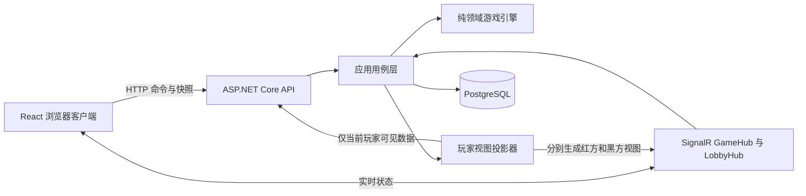

# 中国迷雾象棋开发文档

## 1. 文档目标

本文定义中国迷雾象棋首个可交付版本的产品规则、技术架构、接口边界、数据模型、测试策略和实施顺序。仓库从空目录开始建设，前端使用 React，后端使用 .NET 10。

本文中的规则是首版实现基线。规则发生变化时，应先修改规则版本和测试用例，再修改游戏引擎，避免客户端、服务端和玩家认知出现分歧。

## 2. 产品范围

### 2.1 首版范围

- 标准双人中国象棋对局。
- 在标准规则上叠加双方独立的动态迷雾视野。
- 游客创建房间、通过房间码加入、准备和开始对局。
- 游客进入快速匹配队列，由系统自动配对并随机分配红黑方。
- 服务端权威判定走子、胜负、和棋和视野。
- React 棋盘、选子、候选落点、回合状态、认输与和棋操作。
- ASP.NET Core HTTP API 与 SignalR 实时状态同步。
- 对局断线重连和当前状态恢复。
- 已结束对局的完整棋盘与走子回放。
- 桌面和移动端浏览器适配。

### 2.2 首版不包含

- 人机对战和棋力引擎。
- 排位、积分和赛季。
- 观战。观战视角涉及额外的信息权限，必须单独设计。
- 聊天、好友和社交系统。
- 复杂的亚洲规则长将、长捉裁决。首版使用第 3.4 节明确的循环与无进展和棋规则。
- Redis、消息队列和多实例部署。架构保留扩展点，首版按单个服务实例交付。

## 3. 游戏规则

### 3.1 坐标与棋盘

服务端统一使用红方视角的逻辑坐标，前端只在显示层旋转坐标：

- `file`：横向列，取值 `0..8`，红方视角从左到右递增。
- `rank`：纵向行，取值 `0..9`，从红方底线向黑方底线递增。
- 红方前进方向为 `rank + 1`，黑方前进方向为 `rank - 1`。
- 河界位于 `rank 4` 与 `rank 5` 之间。
- 红方九宫为 `file 3..5, rank 0..2`。
- 黑方九宫为 `file 3..5, rank 7..9`。
- 一维棋盘索引为 `rank * 9 + file`，范围 `0..89`。
- 红方先行。

初始布局：

- 红方底线 `rank 0` 从 `file 0` 到 `8` 依次为车、马、相、仕、帅、仕、相、马、车。
- 红方炮位于 `(1,2)`、`(7,2)`，兵位于 `(0,3)`、`(2,3)`、`(4,3)`、`(6,3)`、`(8,3)`。
- 黑方按棋盘中心旋转后的镜像位置放置，使用车、马、象、士、将、士、象、马、车，以及炮和卒。

代码和协议统一使用棋种枚举 `General`、`Advisor`、`Elephant`、`Horse`、`Rook`、`Cannon`、`Pawn`。中文名称只属于界面文案。

### 3.2 标准走子规则

| 棋子 | 走子规则 | 阻挡规则 |
| --- | --- | --- |
| 将/帅 | 九宫内横向或纵向一步；同列无棋子阻隔时可飞将吃掉对方将/帅 | 普通走法检查目标格；飞将路径不可有棋子 |
| 士/仕 | 九宫内斜向一步 | 目标格不可有己方棋子 |
| 象/相 | 斜向两格，不能过河 | 中间象眼有棋子时不能移动 |
| 马 | 先直行一格，再向外斜行一格 | 第一格马腿有棋子时，对应两个方向均不能移动 |
| 车 | 横向或纵向任意格 | 路径上不能越过棋子 |
| 炮 | 不吃子时与车相同；吃子时必须恰好越过一个炮架 | 炮架与目标之间不可再有棋子 |
| 兵/卒 | 未过河只能向前一步；过河后可向前或横向一步；不能后退 | 目标格不可有己方棋子 |

所有走子必须经过以下校验：

1. 不能移动对方棋子。
2. 不能吃己方棋子。
3. 走子合法性只校验棋种走法、棋盘边界和路径阻挡；服务端可以在走子后计算将/帅是否受到攻击，但该结果不能用于拒绝走子。
4. 双方将帅可以在同一列无子相隔。局面继续进行，轮到其中一方时，该方将/帅可以使用飞将走法直接吃掉对方将/帅。
5. 将/帅是可以被实际吃掉的棋子；任意棋子合法吃掉对方将/帅后立即获胜。

### 3.3 迷雾视野规则

#### 3.3.1 总体定义

每名玩家拥有独立视野。玩家 `P` 在局面 `S` 中的可见格集合为：

```text
Visible(P, S) = OwnSquares(P, S)
              ∪ FixedOrthogonalVision(P, S)
              ∪ MovementRouteVision(P, S)
```

具体规则：

- 所有己方棋子所在格始终可见。
- 每个己方棋子的上、下、左、右相邻一格提供固定视野，越出棋盘的格子忽略。
- 每个己方棋子按其行动几何和当前阻挡情况提供路线视野。
- 路线视野使用同一套棋种走法与路径规则：考虑棋盘边界、九宫、河界、蹩马腿、塞象眼、炮架和路径阻挡，不计算任何棋子的受攻击状态。
- 阻挡路线的第一枚棋子所在格可见，视线在规则指定位置停止。
- 可见格既可能为空，也可能有棋子。敌方棋子仅在其所在格可见时出现在玩家视图中。
- 视野在每次有效走子后根据新局面完整重算，不保留历史可见格和敌方棋子的幽灵位置。
- 双方视野不要求对称，也不会互相公开。

#### 3.3.2 各棋子路线视野

| 棋子 | 路线视野算法 |
| --- | --- |
| 将/帅 | 九宫内四个正交一步目标格。飞将路线仅在同列扫描到的第一枚棋子是对方将/帅时成立，此时中间格和对方将/帅所在格可见。 |
| 士/仕 | 九宫内四个斜向一步目标格。 |
| 象/相 | 每个允许方向先加入象眼格；象眼为空时，再加入不过河的目标格。象眼被占用时，该方向在象眼停止。 |
| 马 | 每个正交方向先加入马腿格；马腿为空时，再加入该马腿对应的两个日字目标格。马腿被占用时，该方向在马腿停止。 |
| 车 | 沿四条正交射线逐格加入视野，遇到第一枚棋子时包含该格并停止该方向。 |
| 炮 | 沿每条正交射线加入炮架前的所有格和第一枚棋子；第一枚棋子作为炮架后继续扫描，加入炮架后的空格和遇到的下一枚棋子，然后停止。没有炮架时扫描到棋盘边缘。该规则保证可能被炮吃掉的目标在行动前可见。 |
| 兵/卒 | 加入当前允许的前进一步；过河后再加入左右一步。固定四格视野仍然生效。 |

路线视野是棋子在当前局面中的观察能力，并非上一步实际经过格子的轨迹。车、炮等棋子移动后，只按新位置重新提供视野。

#### 3.3.3 信息显示边界

- 服务端向每名玩家发送独立的 `GameView`，绝不发送完整活动局面后再交给浏览器隐藏。
- 玩家视图包含所有己方棋子、位于可见格的敌方棋子和所有可见空格。
- 敌方棋子协议对象不包含可跨回合追踪的稳定标识符，避免棋子离开视野后仍被关联追踪。
- 对手走子的起点、终点和路径不作为公共事件发送。界面根据新的玩家视图更新棋盘。
- 己方棋子被吃后会从棋盘消失；服务端可告知被吃棋种，但不额外披露攻击者位置。
- 服务端使用完整棋盘在内部计算双方将/帅是否受到攻击。该内部将军状态不得进入玩家视图、候选落点、HTTP 响应、SignalR 事件或客户端提示。
- 将帅照面时，对方将/帅会按照飞将路线进入正常视野，飞将吃子也会作为普通候选落点出现；客户端只按棋盘和候选落点正常渲染，不显示“将军”提示。
- 对局结束后向双方公开最终完整局面和完整回放。
- 前端不得从缓存中继续显示已经离开视野的敌方棋子。

#### 3.3.4 候选落点与非法请求

服务端可以向当前玩家返回己方棋子的合法候选落点。候选落点只应用棋种移动、棋盘边界、目标格归属和路径阻挡规则；将/帅所在格是否受到攻击不参与计算。

玩家提交走子后，服务端重新校验棋子归属、移动规则和当前局面版本。失败统一返回 `ILLEGAL_MOVE`，不向客户端披露额外的隐藏棋盘信息。非法请求不消耗回合，也不重置计时，并受到每连接和每对局限流。

### 3.4 胜负与和棋

- 任意棋子合法吃掉对方将/帅后，吃子方立即获胜。
- 服务端在内部判定双方的将军状态，但该状态不限制走子、不触发绝杀、不改变胜负，也不禁止将/帅进入对方攻击范围。
- 一方轮到走子时没有任何合法走法，该方判负。
- 认输和启用计时后的超时均判负。
- 双方同意和棋时结束对局。
- 相同局面第三次出现时自动和棋。局面键由棋子布局和当前行棋方组成。
- 连续 120 个半回合没有吃子且没有兵/卒移动时自动和棋；吃子或兵/卒移动会重置计数。
- 首版不实现长捉责任方裁决，循环局面统一按三次重复处理。该能力以后以新的 `ruleVersion` 引入，不能静默改变既有对局规则。

### 3.5 对局状态机

```text
WaitingForOpponent
  -> WaitingForReady
  -> Playing
  -> Finished

Playing -> Finished: generalCaptured | noLegalMove | resignation | timeout
                    | agreedDraw | repetition | noProgress
```

快速匹配使用独立的票据状态机：

```text
Searching -> Matched
          -> Cancelled
          -> Expired

Matched -> Game.Playing
```

其他约束：

- 红黑方在对局开始时确定，默认随机分配。
- 房间对局在双方准备后开始；快速匹配成功后直接创建 `Playing` 对局，不再经过准备阶段。
- 每个玩家同一时刻最多拥有一个 `Searching` 匹配票据和一个未结束对局。
- 未开始房间可离开；开始后的离开视为断线，不立即判负。
- 断线玩家可使用原会话重连。计时模式下时钟继续运行；无计时模式下对局保持。
- 每局保存 `ruleVersion`，首版值为 `fog-xiangqi-v1`。

## 4. 技术基线

### 4.1 前端

- React 19。
- TypeScript，启用严格模式。
- Vite。
- React Router。
- TanStack Query 管理 HTTP 服务端状态。
- `@microsoft/signalr` 接收实时事件。
- CSS Modules 或项目级原生 CSS；首版不引入大型组件库。
- Vitest、React Testing Library 和 Playwright。
- npm 与提交到仓库的 `package-lock.json`。Node.js 使用当前团队统一的长期支持版本，并在 `.nvmrc` 或等效配置中固定。

### 4.2 后端

- .NET 10 与 ASP.NET Core 10。
- C#，启用 nullable reference types 和 implicit usings。
- ASP.NET Core Controllers 或 Minimal API 只选一种；本项目采用 Controllers，以便清晰表达资源、鉴权和错误协议。
- SignalR。
- Entity Framework Core 10。
- PostgreSQL。
- OpenAPI；前端类型从 OpenAPI 文档生成，禁止手工维护第二套请求/响应类型。
- xUnit、FluentAssertions、Npgsql 和 Respawn。

### 4.3 运行与发布基线

- 开发环境：本机 PostgreSQL 18 Windows 服务、ASP.NET Core 和 Vite 开发服务器。
- 项目的开发、构建和测试流程均不依赖 Docker 或其他容器运行时。
- 生产环境：执行 `npm run build` 生成 React 静态资源，执行 `dotnet publish -c Release` 生成后端发布产物；由 ASP.NET Core、IIS 或反向代理提供同源的 `/api`、`/hubs` 和前端资源。
- 生产数据库可以是服务器本机安装的 PostgreSQL 或托管 PostgreSQL，连接方式与开发环境使用相同的 Npgsql 配置。
- 首版单实例运行。需要横向扩展时，再引入 Redis SignalR backplane 和事务发件箱。

### 4.4 本机 PostgreSQL 约定

- 开发基线为 PostgreSQL 18，默认监听 `localhost:5432`。当前开发机使用 `postgresql-x64-18` Windows 服务。
- 开发数据库固定命名为 `mistchess_dev`，应用角色建议命名为 `mistchess_app`。
- API 通过 `ConnectionStrings:MistChess` 读取开发连接字符串。密码保存在 .NET user-secrets 或本机环境变量中，不写入仓库文件。
- 集成测试通过 `MISTCHESS_TEST_ADMIN_CONNECTION_STRING` 读取本机维护库连接；连接目标必须是 `localhost` 或 `127.0.0.1`，维护数据库必须是 `postgres`。
- 测试角色只需具备 `LOGIN`、`CREATEDB` 和删除自己所建数据库的权限，不要求 PostgreSQL 超级用户。
- `scripts/database/Initialize-LocalPostgres.ps1` 负责检查 PostgreSQL 版本、创建开发角色和数据库，并应用 EF Core 迁移。
- `scripts/database/Remove-StaleTestDatabases.ps1` 只允许删除名称以 `mistchess_test_` 开头的本机数据库。
- 初始化脚本必须幂等，不覆盖已有密码，不删除 `mistchess_dev`，也不能对远程主机执行创建或删除操作。

## 5. 总体架构



核心边界：

1. **领域引擎**只处理完整棋盘、标准规则、迷雾视野和结果判定，不依赖 ASP.NET Core、数据库或网络。
2. **应用层**处理房间、快速匹配、权限、事务、并发版本、计时和命令幂等。
3. **投影器**从完整局面为指定玩家生成安全视图，是防止迷雾信息泄露的唯一出口。
4. **API 与 SignalR**只能返回投影器生成的 DTO，不能序列化领域 `GameState`。
5. **React 客户端**负责交互和显示，不拥有最终规则裁定权。

## 6. 建议仓库结构

```text
MistChess/
├─ apps/
│  └─ web/
│     ├─ src/
│     │  ├─ api/                 # HTTP、SignalR 与 OpenAPI 生成类型
│     │  ├─ components/board/    # 棋盘、棋子、迷雾和落点
│     │  ├─ features/game/       # 对局页面与交互状态
│     │  ├─ features/room/       # 创建、加入和准备房间
│     │  ├─ features/matchmaking/ # 快速匹配、等待与取消
│     │  ├─ routes/
│     │  └─ styles/
│     └─ tests/
├─ src/
│  ├─ MistChess.Domain/          # 棋盘、走子、视野、胜负；无基础设施依赖
│  ├─ MistChess.Api/             # Controllers、SignalR、认证与应用用例
│  └─ MistChess.Infrastructure/  # EF Core、PostgreSQL、时钟等适配器
├─ tests/
│  ├─ MistChess.Domain.Tests/
│  └─ MistChess.Api.Tests/
├─ e2e/                          # Playwright 双浏览器端到端场景
├─ scripts/
│  └─ database/
│     ├─ Initialize-LocalPostgres.ps1
│     └─ Remove-StaleTestDatabases.ps1
├─ Directory.Build.props
├─ MistChess.sln
└─ DEVELOPMENT.md
```

避免提前增加独立的 Application、Contracts、SharedKernel 等项目。当前三个后端项目足以形成明确边界；只有出现真实的编译隔离需求时再拆分。

## 7. 领域模型与游戏引擎

### 7.1 核心类型

```csharp
public enum Side { Red, Black }
public enum PieceType { General, Advisor, Elephant, Horse, Rook, Cannon, Pawn }
public enum GameStatus { WaitingForOpponent, WaitingForReady, Playing, Finished }

public readonly record struct Position(byte File, byte Rank);
public readonly record struct Move(Position From, Position To);
public readonly record struct Piece(Side Side, PieceType Type);
```

建议使用长度固定为 90 的棋盘数组，通过 `rank * 9 + file` 访问。领域状态至少包含：

- 当前棋盘。
- 当前行棋方。
- 半回合数。
- 无吃子且无兵卒移动计数。
- 用于重复局面判定的局面键历史。
- 游戏状态与结束原因。
- 规则版本。

### 7.2 引擎职责

领域层按以下顺序提供小而确定的能力：

```text
GenerateMoves(state, from)
IsGeneralThreatened(state, side)
HasAnyMove(state, side)
ApplyMove(state, move)
EvaluateResult(state)
ComputeVisibility(state, side)
ProjectForPlayer(state, side)
```

关键约束：

- `GenerateMoves` 负责棋种、边界、目标格归属和路径阻挡；返回结果不受内部将军状态影响。
- `IsGeneralThreatened` 使用完整棋盘判断指定一方的将/帅是否正被任意敌方棋子攻击，将帅照面时也返回 `true`。该结果是服务端内部派生信息，不能进入 `ProjectForPlayer` 或影响走子合法性与胜负。
- `HasAnyMove` 用于判定当前行棋方是否无棋可走，不得引入绝杀规则，也不能根据内部将军状态过滤走法。
- `ComputeVisibility` 复用棋子的几何与路径辅助函数，但不能直接复用走子列表；固定四格视野、象眼、马腿和炮架后的路线具有独立可见性语义。
- `ApplyMove` 对调用者表现为纯转换：输入状态与走子，返回新状态和领域事件；吃掉对方将/帅时直接产生胜利结果。不得读取数据库、系统时间或当前用户。
- 局面键采用确定性编码；测试必须证明相同布局与行棋方得到相同键。

### 7.3 走子处理流程

```text
接收 MoveCommand
  -> 校验会话属于对局和当前行棋方
  -> 校验 expectedVersion
  -> 检查 clientMoveId 是否已处理
  -> 领域引擎校验完整局面并应用走子
  -> 更新计时、结果和版本
  -> 在一个数据库事务中保存当前状态与走子记录
  -> 分别生成红方和黑方 GameView
  -> 事务提交后向各自连接发送对应视图
```

客户端超时重试相同 `clientMoveId` 时，服务端必须返回第一次处理结果，不得重复走子。

## 8. 后端设计

### 8.1 HTTP API

统一前缀为 `/api`。推荐的首版端点：

| 方法与路径 | 用途 |
| --- | --- |
| `POST /api/sessions/guest` | 创建或恢复游客会话，写入安全会话 Cookie |
| `POST /api/rooms` | 创建房间 |
| `POST /api/rooms/{code}/join` | 使用房间码加入 |
| `POST /api/rooms/{code}/ready` | 设置准备状态 |
| `POST /api/matchmaking/tickets` | 创建快速匹配票据 |
| `GET /api/matchmaking/tickets/current` | 获取当前会话的活动票据或配对结果 |
| `POST /api/matchmaking/tickets/{ticketId}/heartbeat` | 续期仍在搜索的票据 |
| `DELETE /api/matchmaking/tickets/{ticketId}` | 取消仍在搜索的票据 |
| `GET /api/games/{gameId}` | 获取当前玩家的最新 `GameView` |
| `POST /api/games/{gameId}/moves` | 提交走子 |
| `POST /api/games/{gameId}/resign` | 认输 |
| `POST /api/games/{gameId}/draw-offers` | 发起和棋 |
| `POST /api/games/{gameId}/draw-offers/accept` | 接受和棋 |
| `POST /api/games/{gameId}/draw-offers/reject` | 拒绝和棋 |
| `GET /api/games/{gameId}/replay` | 对局结束后获取完整回放 |
| `GET /health/live` | 进程存活检查 |
| `GET /health/ready` | 数据库等依赖就绪检查 |

走子请求：

```json
{
  "from": { "file": 0, "rank": 0 },
  "to": { "file": 0, "rank": 1 },
  "expectedVersion": 12,
  "clientMoveId": "01JEXAMPLE0000000000000000"
}
```

并发冲突返回 HTTP `409` 和 `STALE_VERSION`，客户端随后重新获取快照。规则非法统一返回 HTTP `422` 和 `ILLEGAL_MOVE`。身份与成员权限错误仍使用标准 `401`、`403`、`404`，但 `404` 不区分“对局不存在”和“当前用户无权查看”。

### 8.2 快速匹配

首版提供一个无需积分的快速匹配入口。匹配池由 `(ruleVersion, timeControl)` 精确划分，不同规则版本或计时配置的玩家不能互相匹配。首版默认配置为 `fog-xiangqi-v1` 和无计时；接口保留 `timeControl` 字段，以便以后增加计时模式。

匹配票据包含 `ticketId`、`playerId`、`ruleVersion`、`timeControl`、`status`、`createdAt`、`lastHeartbeatAt`、`expiresAt` 和可空的 `gameId`。状态只允许按以下方向变化：

```text
Searching -> Matched
Searching -> Cancelled
Searching -> Expired
```

匹配行为：

1. 玩家提交 `ruleVersion`、`timeControl` 和 `clientRequestId` 创建票据；同一 `clientRequestId` 重试必须返回原票据。
2. 服务端拒绝已有搜索票据或未结束对局的玩家再次排队。
3. 每个匹配池按 `createdAt`、`ticketId` 依次选择最早的两张有效票据，不能把同一玩家与自己配对。
4. 配对成功后，在同一事务内创建 `Playing` 对局、随机分配红黑方，并把两张票据更新为 `Matched` 和相同的 `gameId`。
5. 事务提交后，通过 `LobbyHub` 分别向两名玩家发送匹配成功事件。客户端也可通过当前票据接口恢复结果。
6. 搜索中的客户端每 30 秒发送一次心跳；票据在最后一次心跳 90 秒后过期。只有未过期的 `Searching` 票据可以参与配对。
7. 取消和配对竞争时以数据库事务先提交者为准。对局已经创建后，取消接口返回 `409 MATCH_ALREADY_CREATED` 和对应 `gameId`。

首版部署为单实例，`MatchmakingCoordinator` 使用进程级异步互斥保证同一时刻只有一个配对循环，并使用数据库事务保证“创建对局和认领两张票据”不可分割。`matchmaking_tickets` 仍然持久化；服务重启后重新扫描有效票据。升级为多实例前，必须把进程锁替换为 PostgreSQL advisory lock 或分布式锁。

匹配成功即开始对局，不设置二次确认。心跳和过期机制负责清理已经离开的搜索者。排位分、隐藏分、机器人补位和跨配置扩池不属于首版。

### 8.3 玩家视图协议

`GameView` 是完整替换式玩家快照，不发送以完整棋盘为基础的增量补丁。棋盘只有 90 个点，完整安全快照成本很低，并能显著降低重连和信息裁剪错误。

```json
{
  "gameId": "01JEXAMPLEGAME000000000000",
  "ruleVersion": "fog-xiangqi-v1",
  "version": 13,
  "status": "playing",
  "result": null,
  "perspective": "red",
  "sideToMove": "red",
  "visibleSquares": [
    { "file": 0, "rank": 0 },
    { "file": 0, "rank": 1 }
  ],
  "pieces": [
    {
      "side": "red",
      "type": "rook",
      "position": { "file": 0, "rank": 0 }
    }
  ],
  "candidateMoves": [
    {
      "from": { "file": 0, "rank": 0 },
      "destinations": [{ "file": 0, "rank": 1 }]
    }
  ],
  "captureSummary": {
    "redLost": [],
    "blackLost": []
  },
  "clock": null
}
```

协议不包含敌方棋子 ID、隐藏格占用状态、完整走子记录或未经裁剪的领域事件，也禁止包含 `checkedSide`、`isInCheck`、`generalThreatened` 等内部将军状态字段。`candidateMoves` 仅在轮到当前玩家时返回，且不能因内部将军状态改变。

### 8.4 SignalR

使用两个职责分离的 Hub：

- `/hubs/lobby`：连接加入当前玩家专属组 `player:{playerId}`，发送 `MatchTicketUpdated(MatchTicketView ticket)` 和 `MatchFound(MatchFoundView match)`。事件只起通知作用；刷新或重连后通过 `GET /api/matchmaking/tickets/current` 恢复真实状态。
- `/hubs/game`：连接携带最新 `version` 订阅当前对局，发送 `GameViewUpdated(GameView view)`、`GameEnded(GameView finalView)`、`OpponentConnectionChanged(ConnectionState state)` 和 `DrawOfferChanged(DrawOfferView offer)`。
- GameHub 不发送将军事件、将军方、攻击者坐标或相关提示事件。

每个对局连接加入独立的用户与对局组合组，例如 `game:{gameId}:player:{playerId}`。禁止把含有某一方视图的数据广播到整个对局组。匹配成功事件必须分别发送给票据所有者，不能公开等待队列或另一名玩家的会话信息。服务端通知只用于加快刷新；游戏客户端重连后始终以 `GET /api/games/{gameId}` 为恢复真相来源。

### 8.5 持久化

首版建议表结构：

- `guest_sessions`：会话标识、显示名、创建和过期时间。
- `rooms`：房间码、创建者、状态、配置和创建时间。
- `matchmaking_tickets`：玩家、规则版本、计时配置、状态、心跳、过期时间、幂等请求标识和匹配后的对局。
- `games`：双方玩家、完整当前状态、行棋方、状态、结果、规则版本、并发版本、时钟和时间戳。
- `moves`：对局、半回合序号、起点、终点、移动棋种、被吃棋种、耗时、`clientMoveId`、走后局面键和时间戳。
- `draw_offers`：发起方、状态和时间戳。

完整棋盘可在 `games` 中使用版本化 JSON 保存，`moves` 保留审计和回放所需数据。领域层不感知 JSON 或 EF Core。`(game_id, client_move_id)` 建立唯一约束，`games.version` 使用乐观并发检查。`matchmaking_tickets` 对 `(player_id)` 的活动搜索状态和 `(player_id, client_request_id)` 建立唯一约束，避免重复排队和重复创建票据。

### 8.6 身份与安全

- 游客会话使用高熵不可预测标识，保存于 `HttpOnly`、`Secure`、`SameSite=Lax` Cookie。
- 修改状态的 HTTP 请求使用防跨站请求伪造保护。
- 生产环境前后端同源；开发环境通过 Vite 代理 `/api` 和 `/hubs`，避免放宽跨域配置。
- 每个匹配票据、房间、对局、回放和 Hub 订阅都重新校验当前用户所有权或成员身份，防止不安全的直接对象引用。
- 房间码只用于定位房间，不能代替玩家身份。
- 对创建和续期匹配票据、创建房间、加入房间、提交走子和 Hub 重连设置速率限制。
- 日志记录对局 ID、玩家 ID、版本、错误码和耗时，不记录会话 Cookie、完整棋盘或某名玩家的完整视图。
- OpenAPI 示例和错误响应不得包含领域 `GameState`。

## 9. 前端设计

### 9.1 页面与状态

首版路由：

- `/`：快速匹配、创建房间或输入房间码。
- `/match`：显示当前匹配票据、等待状态和取消操作。
- `/room/:code`：双方加入与准备。
- `/game/:gameId`：对局。
- `/game/:gameId/replay`：结束后的回放。

状态职责：

- TanStack Query 保存匹配票据、房间和 `GameView` 快照。
- LobbyHub 更新匹配票据缓存；GameHub 收到更高 `version` 的视图后替换 `GameView` 缓存，旧版本事件直接丢弃。
- React 局部状态只保存当前选中格、界面设置和短暂动画。
- 不在全局状态中保存服务端未返回的敌方棋子信息。
- 前端不计算或展示将军状态，不播放将军音效、动画或警告，也不因将/帅受攻击而限制操作。

### 9.2 快速匹配交互

```text
点击快速匹配
  -> POST matchmaking ticket
  -> 进入 /match 并连接 LobbyHub
  -> 每 30 秒发送 heartbeat
  -> 收到 MatchFound 或查询到 Matched
  -> 停止心跳并进入 /game/{gameId}
```

刷新 `/match` 时，客户端通过当前票据接口恢复搜索或匹配结果，不能仅依赖内存中的 SignalR 事件。用户主动取消后返回首页。取消请求遇到 `MATCH_ALREADY_CREATED` 时应直接进入对应对局，避免出现已经配对却停留在首页的状态。

搜索界面只显示等待时长、规则版本、计时配置和取消按钮，不显示队列总人数、对手标识或服务端估算排名。浏览器页面隐藏或短暂断网时仍继续心跳；断网超过票据有效期后显示已过期，并允许创建新票据。

### 9.3 棋盘渲染

建议使用 SVG 绘制棋盘、河界、九宫线、棋子和覆盖层：

1. 逻辑层始终使用服务端坐标。
2. 红方显示时 `(file, rank)` 原向映射；黑方显示时同时翻转两个轴。
3. 先绘制棋盘，再绘制不可见格迷雾遮罩、可见空格、棋子、选中状态和候选落点。
4. 不可见格应明显区别于可见空格，避免玩家把“未知”误解为“没有棋子”。
5. 收到新快照后，以该快照为准删除已离开视野的敌方棋子。
6. 非己方回合、对局结束或请求提交中时禁止再次提交走子。

移动端棋盘保持正方形，操作目标不小于 44 CSS 像素。棋子不能只依赖红黑颜色区分，还应包含中文棋名、轮廓差异和可访问名称。键盘用户应能按棋盘顺序聚焦己方棋子和候选落点。

### 9.4 走子交互

```text
点击己方棋子
  -> 显示该棋子的 candidateMoves
  -> 点击候选目标
  -> 乐观地锁定交互，但不提前改变棋盘真相
  -> POST move
  -> 成功后使用响应或 SignalR 的更高版本 GameView
  -> ILLEGAL_MOVE 时解除锁定并显示通用提示
  -> STALE_VERSION 时重新获取快照
```

不对棋盘执行乐观走子动画。迷雾和吃子可能使预测状态与服务端结果不同，等待权威快照可以避免短暂泄露或回滚闪烁。

## 10. 测试策略

### 10.1 领域规则测试

领域测试使用明确的棋盘构造器建立最小局面，至少覆盖：

- 每种棋子的正常走法、边界和己方目标格。
- 九宫限制、象不过河、塞象眼、蹩马腿。
- 车的各方向阻挡。
- 炮无炮架、一个炮架、两个棋子和多棋子场景。
- 将帅照面时对局继续，轮到的一方可以使用飞将直接吃掉对方将/帅。
- 车、马、炮、兵/卒、士/仕、象/相和将/帅造成攻击时，`IsGeneralThreatened` 能在服务端内部正确判定。
- 内部将军状态不会过滤候选走法、拒绝走子、产生绝杀或直接结束对局。
- 将/帅进入敌方攻击范围后仍可继续对局，任意棋子吃掉将/帅后立即结束。
- 当前行棋方无任何合法走法时判负。
- 三次重复和 120 半回合无进展和棋。

### 10.2 视野测试

每种棋子都应使用表驱动测试，断言完整可见格集合，而非只断言个别格：

- 棋盘中央和边缘的固定上下左右四格。
- 车遇到第一枚己方或敌方棋子时包含阻挡格并停止。
- 炮包含炮架后空格和第二枚棋子，但不包含第二枚棋子之后的格。
- 马腿被占用时只看到马腿，不看到对应目标格。
- 象眼被占用时只看到象眼。
- 将帅飞将路线的成立与不成立。
- 多枚己方棋子视野的并集去重。
- 走子前后视野重新计算，敌方棋子离开视野后不再出现在投影中。

### 10.3 信息隔离测试

这是迷雾实现的发布阻断项：

- 同一完整局面分别投影红方和黑方，验证结果不同且各自正确。
- 将 `GameView` 序列化为 JSON，断言隐藏敌方棋子的类型、坐标和内部 ID 均不存在。
- 将帅受到隐藏棋子攻击时，序列化后的 `GameView` 不包含 `checkedSide`、`isInCheck`、`generalThreatened`、攻击者坐标或将军事件。
- 构造玩家可见内容相同、内部将军状态不同的两个局面，断言其候选落点和玩家协议不因内部状态产生差异。
- HTTP 快照、走子响应和 SignalR 事件使用同一投影器。
- 玩家不能获取非本人参与的对局、活动对局完整回放或对手视图。
- 非法走子的响应不区分隐藏原因。
- 结束前回放不可访问；结束后双方可获取完整回放。

### 10.4 集成与端到端测试

数据库集成测试使用本机 PostgreSQL 18，不依赖容器：

1. 测试程序集启动时读取 `MISTCHESS_TEST_ADMIN_CONNECTION_STRING`，并使用 `NpgsqlConnectionStringBuilder` 验证主机仅为 `localhost` 或 `127.0.0.1`、维护数据库为 `postgres`。
2. `PostgresDatabaseFixture` 为本次运行生成只含小写字母、数字和下划线的数据库名 `mistchess_test_{processId}_{random}`，通过受限测试角色创建数据库。
3. 测试宿主把动态连接字符串注入 `WebApplicationFactory`，并对临时数据库应用真实 EF Core migrations。
4. 同一数据库测试集合串行执行，测试用例之间使用 Respawn 清空业务表并保留迁移历史。领域测试和前端测试仍可并行。
5. 并发匹配测试在同一用例内发起并行请求，用真实 PostgreSQL 事务验证先进先出、唯一约束和原子配对。
6. 测试结束后先释放 Web host 和数据库连接，再调用 `NpgsqlConnection.ClearAllPools()`，最后使用 `DROP DATABASE ... WITH (FORCE)` 删除临时数据库。
7. 测试异常中止留下的数据库由 `Remove-StaleTestDatabases.ps1` 清理；脚本拒绝删除不带 `mistchess_test_` 前缀的数据库。

集成场景至少覆盖创建房间、加入、准备、走子、版本冲突、幂等和重连，以及同池先进先出、不同配置隔离、重复排队拒绝、两张票据只创建一局、心跳续期、过期清理和取消配对竞争。

Playwright 使用两个隔离浏览器上下文分别扮演红方和黑方。快速匹配场景应让两个浏览器自动获得同一 `gameId`、相反阵营并进入对局；后续验证双方迷雾不同、走子后视图正确更新、SignalR 断开后可通过 HTTP 恢复，以及对局结束后双方均能看到完整最终棋盘。

测试不能通过读取私有字段或比较源代码文本来证明规则。断言必须针对走子结果、可见格、玩家协议、数据库事务和权限响应等外部行为。测试配置缺失或指向非本机 PostgreSQL 时必须快速失败，不能回退到内存数据库或 SQLite。

## 11. 开发顺序与验收标准

### 阶段一：仓库与运行骨架

- 创建 .NET solution、三个后端项目、React 应用、测试项目和本机 PostgreSQL 初始化脚本。
- 配置统一格式、nullable、TypeScript strict、环境变量示例和开发代理。
- API 提供健康检查，React 能访问 API。

验收：全新检出后可以使用本机 PostgreSQL 18 初始化脚本创建 `mistchess_dev`，启动 API 和 Web，并在浏览器中看到 API 已连接状态。

### 阶段二：中国象棋吃将制领域引擎

- 实现坐标、棋盘、初始布局和七类棋子的合法走法。
- 实现将帅照面、飞将、服务端内部将军判定、吃将获胜、无棋可走判负与和棋。
- 保持领域项目无 ASP.NET Core 和 EF Core 依赖。

验收：领域规则测试全部通过；服务端能正确判断将/帅受攻击状态，但该状态不限制走子；将帅照面后轮到的一方可以飞将吃子，任意棋子合法吃掉对方将/帅后立即产生胜利结果。

### 阶段三：迷雾与玩家投影

- 实现固定四格视野、逐棋子路线视野和并集。
- 实现 `ProjectForPlayer` 与候选落点。
- 对投影 JSON 执行信息隔离测试。
- 验证内部将军状态不会进入 `GameView`、HTTP 或 SignalR。

验收：同一测试局面的红黑双方快照符合第 3.3 节，序列化结果不含任何隐藏棋子数据或内部将军状态。

### 阶段四：房间、快速匹配、持久化与命令 API

- 实现游客会话、房间状态机、快速匹配票据和配对协调器。
- 实现开始对局、走子、认输、和棋、回放、事务、乐观并发及命令幂等。
- 生成 OpenAPI 并接入前端类型生成。

验收：两个独立会话既可通过房间码开始对局，也可通过同一匹配池自动配对；并发配对只创建一局，刷新后可恢复票据或游戏状态，重复命令不会重复落子。

### 阶段五：SignalR 与 React 对局界面

- 实现 LobbyHub、GameHub、独立玩家组和安全快照推送。
- 实现快速匹配页、房间页、SVG 棋盘、迷雾、候选落点、状态提示和重连。
- 完成红黑视角旋转与移动端布局。

验收：两个浏览器上下文通过快速匹配自动进入同一局并完成一组预设走子；任一客户端网络中断后可以恢复，且从未收到对手的完整视图。

### 阶段六：发布加固

- 完成权限、限流、防跨站请求伪造、日志和健康检查。
- 运行领域、API、前端和双浏览器端到端测试。
- 执行 `npm run build` 和 `dotnet publish -c Release`，组合生产发布产物并在同源部署模式下完成一次完整冒烟对局。

验收：第 12 节完成定义全部满足，部署环境中的快速匹配、HTTP、WebSocket、刷新恢复和结束回放均可用。

## 12. 完成定义

首版只有同时满足以下条件才可发布：

- 七类棋子的走法、内部将军判定、将帅照面、飞将、吃将获胜、无棋可走判负和首版和棋规则均由自动化测试覆盖。
- 第 3.3 节每一种视野算法都有完整集合断言。
- 后端是唯一权威规则源，篡改前端请求不能越权走子或查看隐藏状态。
- HTTP、SignalR、错误响应和活动对局回放均通过信息隔离测试，活动对局协议不包含内部将军状态或相关提示。
- 两名玩家既可以通过房间码完成准备和对局，也可以通过快速匹配自动进入对局，并完成断线恢复和结束回放。
- 红黑双方看到各自正确的动态迷雾，旧的敌方位置不会作为当前事实残留。
- 并发走子、重复请求和过期版本不会造成一回合多次落子。
- 匹配池隔离、先进先出、票据过期、取消竞争和原子配对均通过集成测试。
- 桌面与移动端可操作，棋盘具备基本键盘和屏幕阅读器标签。
- 数据库迁移可在空的本机 PostgreSQL 数据库执行，集成测试可自动创建、重置和删除临时数据库，服务可通过健康检查，前后端生产构建可启动。

## 13. 规则变更原则

以下内容会改变玩家策略或信息量，必须提升 `ruleVersion` 并增加迁移说明：

- 固定视野的方向或距离。
- 炮架后的可见范围。
- 阻挡格是否可见。
- 是否让内部将军状态影响走子、胜负，或将其公开给客户端。
- 是否保留最后已知敌方位置。
- 是否允许观战及观战者使用哪一方视野。
- 长捉和循环局面的裁决方式。

规则版本属于每一局对局，服务升级后仍需按该局创建时的版本继续裁定，不能在进行中的对局内切换规则。